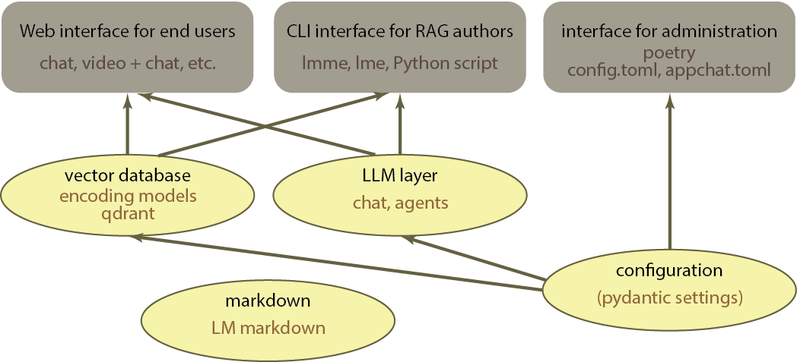

# Users and interfaces

There are broadly three groups of users for LM markdown for eduction, and correspondingly three interfaces.

1. Student users, or more generally RAG users, are those that log on to a web server and utilize the services (chats, webcasts etc.) through a web interface. There is a skeleton implementation of this web interface using the Gradio package. The web interface is self-explanatory for its users.

2. RAG authors create, revise, and ingest documents. They primarily interact with the system through a command language interface (CLI), although they could also write Python scripts to use the API directly. See the chapter on [RAG authoring](../Handbook/RAGauthoring.md) in the Handbook.

3. Administrators and developers set up an LM markdown for education server. The package is managed by poetry, which may be used for installation. They also use the files config.toml and appchat.toml to configure the server and the RAG application. See the [configuration](../Handbook/Configuration.md) manual.

The figure below shows how the softare is organized to serve these interfaces.

## Gradio web interface

Gradio allows quickly prototyping web interfaces for AI applications. One specifies the elements of the interface stacked along rows or columns of the page, and provides callbacks to respond to the user requests. Gradio has a markedly server-centered architecture. All action takes place on the server when the callbacks are invoked by the framework, which passes in the argument of the callback the request of the user or information on events on the web client.

The Gradio modules of the implementation are roughly composed of three sections. In the first, moudle-level objects are set up to reference other functionality (the database, the language model). This functionality is automatically configured as specified in config.toml and appchat.toml. In the second section, the callbacks are defined using these module-level objects. In the third and final section, the Gradio interface is defined with the callback functions, and a launch function is called on the Gradio interface object. This function blocks while a server is set up with the application. Hence, to start a server one runs the module through the Python interpreter. For example, `python -m appChat` starts the appChat server.

The coupling with Gradio is weak. One could easily implement an alternative web server offering the same callback functionality through endpoints.

In a chat application, the important callback is the one that provides the message from the user, optionally with the list of the messages of the previous interaction (this function is `gradio_callback_fn` in appChat.py). This callback returns the response to be displayed in the chat.

## CLI

LM markdown for education offers two alternative CLIs. The first CLI can be invoked from a bash or Powershell terminal pointing to the folder where LM markdown for education was installed. Commands have the form lmme command [subcommand|--parameters ...]. Type `lmme --help` for a list and short explanation of all available commands. They may take some time since at each invocation the Python interpreter and all libraries must be reloaded.

To load the library, keep it in memory and start a terminal that accepts the same commands, type `lmme terminal`. Type `help`for a list and short explanation of the same available commands. This second CLI preloads Python and all libraries, so that at each subsequent invocation the response is very fast. The first CLI is most useful when one need to call LM markdown for education with only one or two commands. The second CLI is probably the most practical choice when the interaction with the language model is more intensive.

## Configuration and management

This is a poetry-managed project: after cloning the repository, installation of dependencies is given by `poetry install`.

Two configuration files (config.toml and appchat.toml) change the settings of the project started as a web server or through the CLI. When using the framework from the CLI, many of these options can be overridden. All can be overridden when using the framework programmatically.

LM markdown for education uses the Pydantic settings package to read from and write to configuration files. This package validates the input from the configuration files or from the parameters given at the CLI.

# Main software domains

The software provides the following main functionality:

1. Interaction with a vector database according to a specified encoding model. The encoding model is the specification of how semantic information should be embedded in the database. For more details, see [encoding](../Handbook/EncodingEmbedding.md). At present, one vector database implementation is supported (Qdrant).

2. Preparation and processing of markdown documents for RAG use. This functionality is based on services of the LM markdown package, and includes parsing and representing content of markdown documents.

3. Interaction with language models and language model and embedding providers. This functionality is based on services of the LM markdown package. It currently uses LangChain models of the LLM providers, allowing use of different models in the same application. Some functionality is packaged into LangChain "runnables", which can be simply called through the member function 'invoke' to obtain the response from the language model for a specific task.

    Finally, all the above functionality is plugged onto a

4. configuration module, which allows customization (choice of language providers, revision of prompts, encoding model to the database, etc.) The file config.toml contains settings on the database and the language models. The file appchat.toml configures the web chat application.

## Vector database

Common language model infrastructures allow swapping various vector databases to implement RAG. LM markdown for education uses Qdrant, a vector database implemented with sqlite, and offers fine-graded options to specify the encoding of information used to embed the semantic properties of documents and document parts (see [encoding](../Handbook/EncodingEmbedding.md)).

A specific option in LM markdown for education is the possibility of retrieving whole document parts instead of the fragments of text used to embed documents. Text emebddings struggle to accurately encode the semantics of large texts. For this reason, the text is usually chunked up into smaller pieces, and the embeddings of these pieces are used to retrieve the content from the vector database. In LM markdown for education, text is chunked, but at retrieval the whole section of text where the chunk was located can optionally be retreived instead of the chunk itself (this functionality is available natively in Qdrant). This decouples the encoding for text for the purposes of locating relevant content and the selection of text that is retrieved. When a whole section of text is retrieved, the context that the language model has access to to formulate a response is coherent and systematic.

Large language models can at present handle very large context windows, and have no difficulty extracting information from a larger portion of text. They will use the text in the context effectively even when this text is large. When the context contains smaller disjoint chunks, the language models can make a very good job of producing a coherent response (they present a strong tendency to produce polished, fluent and somewhat conventional text). However, they will introduce more of their own content in filling the gaps between the retrieved chunks. When the text in the context is organic and coherent, there is a higher chance that its content is reproduced accurately.

## Markdown document processing

LM markdown processes markdown documents by internally building a hierarchical representation of their content (i.e., a tree) based on the headings and the heading levels (i.e., the titles of chapters and the level of the chapters). This hierarchical representation allows LM markdown to exchange messages with language models about the markdown file at different levels of granularity, providing the text at different levels of the tree.

Another specific functionality of LM markdown is the use of metadata in markdown documents. Metadata (consisting yaml objects embedded in the document) are usually only present as the header of the whole document. The markdown specification, however, allows metadata to be interspersed between blocks across the whole document without restrictions. LM markdown uses these intra-document metadata blocks to specify metadata at each level of the hierarchical representation of the document. Metadata before a heading annotate the whole text under the heading and subheadings, and metadata before a text block annotate only the following text block (for details, see [Working with markdown](../Handbook/Markdown.md)).

These metadata are used in two ways. One is to allow the language model to reply to queries of the user. The other is to insert information extracted from text that is used to encode the semantic properties of the text for RAG. These uses are illustrated in [RAG authoring](../Handbook/RAGauthoring.md).

## Interaction with language models

The project uses LangGraph to provide a unified interface for using different large language model providers and specify workflows of chained prompted models/agents. 

A set of prompts are pre-packaged and created as LangChain 'runnables' that execute a predefined task. These runnables are composed together to form the graphs. In general, the provided graphs should suffice to implement the chatbot. However, it is possible to extend the graph library with new graphs, since the interface is unified by the 'runnable' class.

The functionality of the interaction with language models is split between the graphs themselves and the streams emitted by these graphs. Several properties of the applications, such as logging the exchanges to a database, streaming the retireved context, validation of content etc. take place at the level of the stream, not at the graph. The output stream of the same graph may be combined with several stream adapters that provide the desired functionality. The adapters library is generic and should be applicable to different graphs.
